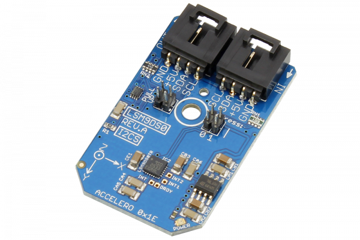

# LSM9DS0

Manufactured by STMicroelectronics, the LSM9DS0 is a system-in-package featuring a 3D digital linear acceleration sensor, a 3D digital angular rate sensor, and a 3D digital magnetic sensor.The LSM9DS0 has a linear acceleration full scale of ±2g/±4g/±6g/±8g/±16g, a magnetic field full-scale of ±2/±4/±8/±12 gauss and an angular rate of ±245/±500/±2000 dps.
This Device is available from www.ncd.io 

[SKU: LSM9DS0_I2CS]

(https://store.ncd.io/product/lsm9ds0-3d-accelerometer-gyroscope-magnetometer-i2c-mini-module/)
This Sample code can be used with Arduino.

Hardware needed to interface LSM9DS0 sensor with Arduino

1. <a href="https://store.ncd.io/product/i2c-shield-for-arduino-nano/">Arduino Nano</a>

2. <a href="https://store.ncd.io/product/i2c-shield-for-arduino-micro-with-i2c-expansion-port/">Arduino Micro</a>

3. <a href="https://store.ncd.io/product/i2c-shield-for-arduino-uno/">Arduino uno</a>

4. <a href="https://store.ncd.io/product/dual-i2c-shield-for-arduino-due-with-modular-communications-interface/">Arduino Due</a>

5. <a href="https://store.ncd.io/product/lsm9ds0-3d-accelerometer-gyroscope-magnetometer-i2c-mini-module/">LSM9DS0 3D Accelerometer Gyroscope Magnetometer Sensor</a>

6. <a href="https://store.ncd.io/product/i%C2%B2c-cable/">I2C Cable</a>

LSM9DS0:

Manufactured by STMicroelectronics, the LSM9DS0 is a system-in-package featuring a 3D digital linear acceleration sensor, a 3D digital angular rate sensor, and a 3D digital magnetic sensor.The LSM9DS0 has a linear acceleration full scale of ±2g/±4g/±6g/±8g/±16g, a magnetic field full-scale of ±2/±4/±8/±12 gauss and an angular rate of ±245/±500/±2000 dps.

Applications:

• Indoor navigation,smart user interfaces,gaming and virtual reality input devices,display/map orientation and browsing, etc.

How to Use the LSM9DS0 Arduino Library

The LSM9DS0 has a number of settings, which can be configured based on user requirements.
          
1.Gyro Data rate selection:The following command is used to set the data rate for Gyro.

          lsm.setGyroDataRate(GYRO_DATARATE_95_12_5);      // ODR (Hz): 95, Cutoff: 12.5
            
2.Gyro output range selection:The following command is used to select the range of output of gyro.

            lsm.setGyroScale(GYRO_SCALE_2000DPS);            // 2000 dps
            
3.Accelometer data rate selection:The following command is used to select the data rate of accelometer.            
            
            lsm.setAccelDataRate(ACCEL_DATARATE_3_125HZ);        // AODR (Hz): 3.125
            
4.Accelometer output range selection:The following command is used to select the range of output of accelometer.
            
            lsm.setAccelRange(ACCEL_RANGE_16G);          // ±16 g

5.Magnetometer data rate selection:The following command is used to select the data rate of magnetometer.          
            
            lsm.setMagDataRate(MAG_DATARATE_3_125HZ);    // MODR (Hz): 3.125
            
6.Magnetometer output range selection:The following command is used to select the range of output of accelometer.
            
            lsm.setMagGain(MAG_GAIN_12GAUSS);            // ±12 guass
           
